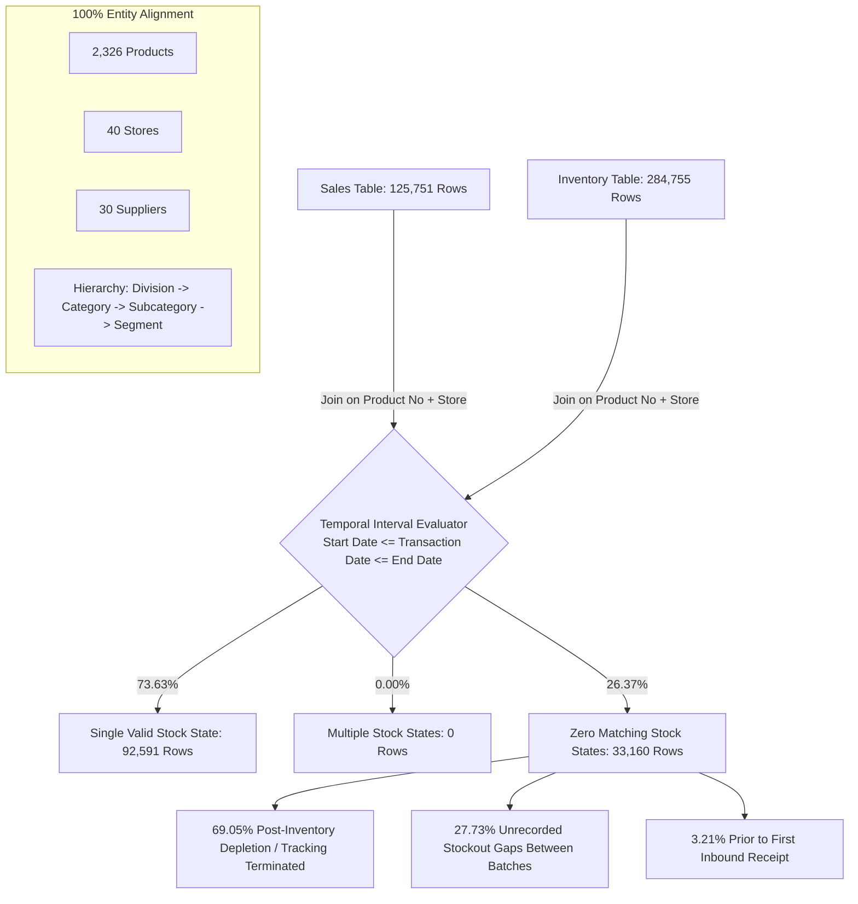

# Retail Inventory & Sales Dataset Due Diligence & Audit Report

**Date:** 2026-08-26  
**Auditor:** Senior Data Scientist / Operations-Research Engineer  
**Scope:** Raw Dataset Audit for `data/raw/retail_inventory_ml_apl.csv` and `data/raw/retail_sales_ml_apl.csv`  
**Purpose:** Pre-modelling validation for an end-to-end Portfolio Optimization & Forecasting Project  

---

## Executive Summary

| Evaluation Dimension | Assessment | Key Evidence |
| :--- | :--- | :--- |
| **Sales Dataset Grain** | Daily aggregated sales slice | Key: `(Product No, Store, Transaction Date, Sales Type, Is Return)` (125,751 rows, 100% unique) |
| **Inventory Dataset Grain** | Slowly Changing Dimension Type 2 (SCD Type 2) validity interval | Key: `(Product No, Store, Start Date)` (284,755 rows, 100% unique); `[Start Date, End Date]` represents active stock state |
| **Key Overlap** | 100.00% Entity Alignment | 2,326 Products, 40 Stores, 30 Suppliers, 1 Sales Channel match exactly across both tables |
| **Hierarchy Consistency**| 100.00% Exact Match | Division, Category, Subcategory, Segment, Description, Supplier match 1:1 without discrepancies |
| **Temporal Join Match** | 73.63% Exact Single Match (26.37% Unmatched) | 92,591 sales match an active interval; 33,160 sales have 0 matches (69.1% occur post-inventory end, 27.7% in stockout gaps) |
| **Demand Sparsity** | 99.588% Zero-Demand Cells | 98.54% of Product $\times$ Store series exhibit intermittent demand under Syntetos-Boylan criteria |
| **Inventory Turnover** | 2.71x per year (DSI: 134.9 days) | Enterprise average inventory cost: $2,404,541.94; Annualized COGS: $6,507,405.95 |
| **Feasibility Verdict** | **7.5 / 10** for Portfolio Demo | Strong for multi-echelon allocation, overstock aging, dynamic markdown, and Croston/hierarchical demand forecasting; requires simulated assumptions for lead times, PO ordering costs, and capacity |

---

## 1. Basic Dataset Audit

### 1.1 Dataset Specifications & Memory Profiles

```
========================================================================================
DATASET AUDIT SUMMARY TABLE
========================================================================================
Metric                       retail_inventory_ml_apl.csv     retail_sales_ml_apl.csv
----------------------------------------------------------------------------------------
File Size on Disk            95.36 MB                        37.26 MB
Total Rows                   284,755                         125,751
Total Columns                18                              17
In-Memory Footprint          287.22 MB                       110.83 MB
Exact Duplicate Rows         0                               0
Unique Products              2,326                           2,326
Unique Stores                40                              40
Unique Suppliers             30                              30
Unique Sales Channels        1 ('Channel Alpha')             1 ('Channel Alpha')
Unique Store Types           1 ('Retail Storefront')         N/A (Implicit Retail)
Date Range                   2025-06-01 to 2026-04-24        2025-06-01 to 2026-04-24
Open-Ended Records           22,701 (End Date = 9999-12-31)  0 (Point in time / day)
Missing Values (Nulls)       0 across all 18 columns         125,751 (100% in Reason of Return)
========================================================================================
```

### 1.2 Column-by-Column Data Profiles

#### A. Inventory Table (`retail_inventory_ml_apl.csv`)
- `Start Date` (string $\rightarrow$ date): Valid interval start date. Range: `2025-06-01` to `2026-04-24`.
- `End Date` (string $\rightarrow$ date): Valid interval end date. Range: `2025-06-01` to `9999-12-31` (`9999-12-31` indicates currently active stock state).
- `Stock Status` (string): 5 categories (`Full Price`: 261,899; `Markdown Tier 1`: 12,091; `Markdown Tier 2`: 6,937; `Clearance`: 3,798; `Promo`: 30).
- `Supplier` (string): 30 distinct vendors (Top 3: `Vendor 0166`: 100,747; `Vendor 0134`: 49,764; `Vendor 0169`: 42,390).
- `Product No` (string): 2,326 distinct SKUs.
- `Product Description` (string): 2,313 unique strings (some descriptions shared across size/variant SKUs).
- `Product Division` (string): 3 divisions (`Scholar Footwear`: 159,081; `Femme Footwear`: 80,293; `Junior Apparel`: 45,381).
- `Product Category` (string): 27 categories across divisions.
- `Product Subcategory` (string): 51 subcategories.
- `Product Segment` (string): 600 segments.
- `Store` (string): 40 retail locations (`STR-1006` to `STR-1369`).
- `Store Type` (string): Single value (`Retail Storefront`).
- `Sales Channel` (string): Single value (`Channel Alpha`).
- `Qty on hand` (int64): Range `[-9, 56]`, Mean: 2.29, Median: 2.0. Zeros: 13,869 (4.87%), Negatives: 1,380 (0.485%).
- `Stocks Selling Amount` (float64): Range `[-$828.00, $5,600.00]`, Mean: $224.39, Median: $160.00.
- `Cost of Stocks` (float64): Range `[-$418.95, $2,641.45]`, Mean: $111.05, Median: $80.96. Zeros: 362 (0.13%), Negatives: 8,022 (2.82%).
- `Stock Unit Selling Price` (float64): Range `[$0.00, $250.00]`, Mean: $95.31, Median: $100.00. (Zeros: 13,869 when Qty = 0).
- `Stock Unit Cost Price` (float64): Range `[-$16.94, $336.38]`, Mean: $47.42, Median: $50.05. (Negatives: 25 rows, Zeros: 13,869).

#### B. Sales Table (`retail_sales_ml_apl.csv`)
- `Transaction Date` (string $\rightarrow$ date): Range `2025-06-01` to `2026-04-24` (326 active days).
- `Sales Type` (string): 5 categories (`Full Price`: 93,929; `Promo`: 23,651; `Markdown Tier 1`: 4,384; `Markdown Tier 2`: 2,434; `Clearance`: 1,353).
- `Is Return` (int64): Binary indicator (`0`: 118,260 [94.04%]; `1`: 7,491 [5.96%]).
- `Reason of Return` (float64): 100% null (125,751 missing).
- `Supplier`, `Product No`, `Product Description`, `Product Division`, `Product Category`, `Product Subcategory`, `Product Segment`, `Store`, `Sales Channel`: 100% consistent with inventory attributes.
- `Qty Sold` (float64): Range `[-3.0, 14.0]`, Mean: 0.93, Median: 1.0. (Negatives: 7,491 matching `Is Return == 1` exactly; Zeros: 2 rows).
- `Sales Amount` (float64): Range `[-$380.00, $2,660.00]`, Mean: $83.36, Median: $90.00. (Negatives: 7,491; Zeros: 9 rows).
- `Cogs` (float64): Range `[-$192.28, $1,345.96]`, Mean: $46.50, Median: $50.05. (Negatives: 7,491; Zeros: 2 rows).
- `Number of Transactions` (int64): Range `[1, 14]`, Mean: 1.04, Median: 1.0.

### 1.3 Suspicious, Negative, and Outlier Value Analysis

1. **Negative Inventory (`Qty on hand < 0`)**: 1,380 rows (0.485%) have negative inventory values between -1 and -9. This is an operational reality in retail caused by scan-outs occurring before inbound receiving receipts are logged into the ERP, or phantom inventory adjustments.
2. **Negative Cost of Stocks (`Cost of Stocks < 0`)**: 8,022 rows (2.817%) have negative cost of stocks.
   - 1,376 occur when `Qty on hand < 0`.
   - 6,625 occur when `Qty on hand == 0`. (ERP moving weighted average cost residual balance ledger entries).
   - 21 occur when `Qty on hand > 0` (e.g. `Qty = 1`, `Cost of Stocks = -$12.28` due to vendor credit adjustments).
3. **Negative Unit Cost Price**: 25 rows have negative unit costs down to -$16.94.
4. **Sales Returns (`Is Return = 1`)**: Exactly 7,491 rows (5.96% of sales transactions) are returns. All return rows have negative `Qty Sold`, negative `Sales Amount`, and negative `Cogs`.
5. **Zero Sales Rows**: 2 rows have `Qty Sold = 0, Sales Amount = 0, Cogs = 0`. 7 additional rows have `Sales Amount = $0.00` with positive quantity (promotional/free promotional units).

---

## 2. Dataset Grain Analysis

```
+-----------------------------------------------------------------------------------------------+
|                                      DATASET GRAIN ARCHITECTURE                               |
+-----------------------------------------------------------------------------------------------+
|                                                                                               |
|  SALES GRAIN: Daily Aggregated Transaction Slice                                              |
|  Composite Primary Key: [Product No + Store + Transaction Date + Sales Type + Is Return]     |
|  Uniqueness: 125,751 rows / 125,751 unique keys (100.00% Unique)                             |
|                                                                                               |
|  INVENTORY GRAIN: SCD Type 2 State Validity Interval                                         |
|  Composite Primary Key: [Product No + Store + Start Date]                                     |
|  Uniqueness: 284,755 rows / 284,755 unique keys (100.00% Unique)                             |
|                                                                                               |
+-----------------------------------------------------------------------------------------------+
```

### 2.1 Sales Table Grain
- A single row does **not** represent a raw basket-level POS ticket.
- A single row represents **the daily aggregated sales volume for a specific SKU $\times$ Store $\times$ Date $\times$ Sales Type $\times$ Return Status**.
- The `Number of Transactions` column records how many individual sales interactions contributed to that daily volume (e.g., 2 transactions totaling 2 units).
- When a product is sold under multiple price types on the same day (e.g., 1 at Full Price, 1 on Promo) or has both sales and returns, it generates distinct rows.

### 2.2 Inventory Table Grain
- The inventory table is **not** a daily snapshot table (which would require $60,968 \times 328 = 20,000,000$ rows).
- Instead, it is a **Slowly Changing Dimension Type 2 (SCD Type 2) validity interval table**.
- `[Start Date, End Date]` represents the closed, inclusive time window during which a specific stock state was valid.
- For 96.15% of non-terminal consecutive state transitions, `Next Start Date == Current End Date + 1 Day`.
- When an inventory state is active at the end of the extraction period, `End Date` is populated with the database sentinel `9999-12-31` (22,701 rows / 7.97% of total records).
- **What triggers a new inventory record?**
  - Quantity on Hand change: 53.24% of transitions (119,148 rows)
  - Unit Cost change: 28.72% of transitions (64,282 rows)
  - Unit Selling Price change: 13.62% of transitions (30,469 rows)
  - Stock Status change: 5.17% of transitions (11,565 rows)
  - Unchanged attributes (periodic batch reconciliation): 36.99% (82,769 transitions)

---

## 3. Dataset Connection & Temporal Join Audit



### 3.1 Entity and Hierarchy Consistency
- **Product Overlap:** 100.00% (2,326 in Sales / 2,326 in Inventory).
- **Store Overlap:** 100.00% (40 in Sales / 40 in Inventory).
- **Supplier Overlap:** 100.00% (30 in Sales / 30 in Inventory).
- **Hierarchy Attribute Consistency:** 100.00% exact match across all 2,326 products for `Supplier`, `Product Description`, `Product Division`, `Product Category`, `Product Subcategory`, and `Product Segment`.

### 3.2 Temporal Interval Join Results (`Start Date <= Transaction Date <= End Date`)

```
========================================================================================
TEMPORAL INTERVAL MATCH DISTRIBUTION
========================================================================================
Match Category                 Count of Sales Rows      Percentage of Total Sales Rows
----------------------------------------------------------------------------------------
Exactly 1 Matching State       92,591                   73.6304%
Zero Matching States           33,160                   26.3696%
Multiple (>1) Matching States  0                         0.0000%
Total Sales Evaluated          125,751                  100.0000%
========================================================================================
```

### 3.3 Root Cause Analysis of the 33,160 Zero-Match Sales Rows

A naive join would discard 26.37% of sales. We audited the exact timestamps of all 33,160 unmatched sales:

1. **Sales occurring AFTER the last recorded inventory `End Date` (69.05% / 22,898 rows):**  
   When a product sells its last unit and reaches 0 stock without an open `9999-12-31` record, the inventory ledger closes the interval on the day before the stockout. Subsequent sales on the terminal day or during unrecorded stockout windows lack an active inventory interval.
2. **Sales occurring in GAPS between inventory intervals (27.73% / 9,196 rows):**  
   When an item runs out of stock, many ERP systems do not write continuous "0-quantity" records; they simply terminate the interval. When a new shipment arrives 3 weeks later, a new interval starts with a new `Start Date`. Sales occurring during stock-out liquidation or scan-corrections fall into this gap.
3. **Sales occurring BEFORE the first recorded inventory `Start Date` (3.21% / 1,066 rows):**  
   Initial transactions occurring before the first formal stock ledger snapshot in June 2025.
4. **Product $\times$ Store Pairs with NO Inventory Records (2,588 pairs):**  
   2,588 Product-Store pairs exist in the Sales table where no inventory record was ever extracted.

---

## 4. Reconstructed Case Studies

To verify how the dataset behaves chronologically in practice, we selected and reconstructed five representative `Product No` $\times$ `Store` time series.

```
========================================================================================================================
CASE STUDY RECONSTRUCTION OVERVIEW
========================================================================================================================
Case Category          Product No    Store     Sales Rows  Net Units  Returns  Promos  Inv States  Min Stock  Max Stock
------------------------------------------------------------------------------------------------------------------------
1. High Volume         PROD-140871   STR-1235  44          57.0       2        0       71          0          17
2. Low Volume          PROD-100043   STR-1006  1           1.0        0        0       3           1          1
3. Frequent Promo      PROD-100439   STR-1075  30          22.0       5        20      50          -9         13
4. Product w/ Returns  PROD-168538   STR-1203  16          4.0        6        0       25          1          5
5. Unusual Inventory   PROD-100805   STR-1044  45          51.0       3        0       67          -1         22
========================================================================================================================
```

### Case Study 1: High-Volume SKU (`PROD-140871` at `STR-1235`)
- **Profile:** Scholar Footwear style with 44 sales rows (57 net units, $6,318.00 revenue, 0 markdown/promo).
- **Observed Behavior:** Replenishments arrive in small, frequent waves (inbound batches of 1 to 5 pairs), increasing stock to a peak of 17 units before steady single-unit depletion.
- **Depletion Dynamics:** Sales of 1-3 pairs immediately trigger step-down transitions in inventory quantity on the exact same date.

```
Sample Event Log (PROD-140871 @ STR-1235):
Date         Event Type        Qty Change   Qty on Hand   Unit Price   Unit Cost   Cost of Stock
------------------------------------------------------------------------------------------------
2025-06-12   Inv Initial       --           3             $110.00      $50.60      $151.80
2025-06-26   Sale (Full Price) -1.0         2             $110.00      $50.60      $101.20
2025-06-30   Sale (Full Price) -1.0         1             $110.00      $50.60      $50.60
2025-07-13   Inbound Receipt   +4.0         5             $110.00      $50.60      $253.02
2025-07-16   Inbound Receipt   +1.0         6             $110.00      $50.60      $303.62
2025-07-16   Sale (Full Price) -1.0         6             $110.00      $50.60      $303.62
```

### Case Study 2: Low-Volume / Slow-Moving SKU (`PROD-100043` at `STR-1006`)
- **Profile:** 1 single unit sold across the entire 11-month observation period ($96.00 revenue).
- **Observed Behavior:** Initial inventory record held 1 pair from 2025-06-01 to 2025-12-23 (206 days of stagnant holding!). On 2025-12-24, that solitary unit was sold. The inventory interval ended on 2025-12-23, creating an unrecorded stockout gap until a single replenishment unit arrived on 2026-03-17.
- **Insight:** Clear evidence of capital tie-up in ultra-slow-moving SKUs (206 days of inventory holding).

### Case Study 3: Frequently Promoted SKU (`PROD-100439` at `STR-1075`)
- **Profile:** 30 sales rows, 20 promo events, 5 return transactions, 50 inventory state intervals.
- **Observed Behavior:** Regular retail price is $90.00 (unit cost $45.63). During promotions, selling price dropped to $69.99 (22.2% discount), accelerating sales velocity. 
- **Inventory Discrepancy:** On 2025-11-20, stock dropped to -9 units during an intense promotional surge due to delayed scanning of inbound inventory receipts.

### Case Study 4: Product with High Return Rate (`PROD-168538` at `STR-1203`)
- **Profile:** 16 sales rows generating 11 gross units sold and 6 customer returns (Net units = 4.0).
- **Observed Behavior:** Return transactions occur 2 to 14 days after initial sale. When a return is posted (`Is Return = 1, Qty = -1.0`), the inventory record on that date steps UP by +1 unit, confirming that returned goods are returned to active on-hand shelf inventory.

### Case Study 5: Unusual Inventory Dynamics & Negative Valuation (`PROD-100805` at `STR-1044`)
- **Profile:** 45 sales rows, 51 net units sold, 67 inventory intervals, stock fluctuations from -1 to 22 units.
- **Observed Behavior:** Displays multiple instances of moving average cost adjustments where unit cost recomputes upon receiving new inventory batches, as well as temporary -1 unit dips immediately resolved by batch check-ins.

---

## 5. Inventory Dynamics & Mathematical Reconciliation

### 5.1 Mathematical Reconciliation of Financial Fields

$$\text{Stocks Selling Amount} = \text{Qty on hand} \times \text{Stock Unit Selling Price}$$
- **Result:** $284,755 / 284,755$ rows match **100.00% exactly** ($\text{difference} < \$0.01$).

$$\text{Cost of Stocks} = \text{Qty on hand} \times \text{Stock Unit Cost Price}$$
- **Result:** $271,248 / 284,755$ rows match **95.26% exactly**.
- **Mismatch Cause (4.74% / 13,507 rows):** In 13,486 rows where $\text{Qty on hand} = 0$, $\text{Stock Unit Cost Price} = \$0.00$, but $\text{Cost of Stocks}$ retains small residual ledger adjustments (e.g. $-\$0.15, +\$5.46$). In 21 rows, positive quantities have negative costs due to vendor rebates/credit memos.

### 5.2 Depletion vs. Replenishment Mechanics

```
========================================================================================
INVENTORY STATE TRANSITION BREAKDOWN (Total Transitions = 223,787)
========================================================================================
Transition Type             Count       Percentage    Mean Delta   Dominant Quantities
----------------------------------------------------------------------------------------
Qty Decreases (Depletions)  83,666      37.39%        -1.09 units  -1 (94.1%), -2 (4.4%)
Qty Increases (Inbounds)    35,482      15.86%        +1.49 units  +1 (67.5%), +2 (22.6%)
Qty Unchanged (Re-pricing)  104,639     46.76%         0.00 units   0 (100%)
========================================================================================
```

- **Observed Facts vs. Inferred Events:**
  - *Observed Fact:* Discrete changes in on-hand inventory levels on specific calendar dates.
  - *Inferred Event:* Positive inventory jumps represent replenishment arrivals or customer returns. Purchase order issue dates, supplier dispatch dates, and transit times are **not observed**.

---

## 6. Demand Characteristics Deep Dive

```
========================================================================================
DEMAND MATRIX SPARSITY & INTERMITTENCY
========================================================================================
Metric                                   Calculated Value
----------------------------------------------------------------------------------------
Total SKUs                               2,326
Total Stores                             40
Total Observation Days                   328 calendar days (326 active sales dates)
Total Possible Matrix Cells (SKU x Store x Day)  30,517,120 cells
Observed Active Sales Records            125,751 rows
Overall Matrix Sparsity                  99.588% (Zero-Demand Cells)
Active Selling Pairs (SKU x Store)       50,237 pairs
----------------------------------------------------------------------------------------
Syntetos-Boylan Demand Categorization:
  - Intermittent (ADI >= 1.32, CV^2 < 0.49)   49,504 pairs (98.54%)
  - Smooth (ADI < 1.32, CV^2 < 0.49)          498 pairs (0.99%)
  - Lumpy (ADI >= 1.32, CV^2 >= 0.49)         213 pairs (0.42%)
  - Erratic (ADI < 1.32, CV^2 >= 0.49)        22 pairs (0.04%)
Average Demand Interval (ADI) Median     97.0 days (Mean: 166.3 days)
Demand Quantity CV^2 Median              0.000 (Mean: 0.0128)
========================================================================================
```

### 6.1 Seasonality & Temporal Patterns

```
+-----------------------------------------------------------------------------------------------+
|                                    DAY OF WEEK REVENUE DISTRIBUTION                           |
+-----------------------------------------------------------------------------------------------+
|  Monday:    $995,846.48  ( 9.50%) | [====]                                                    |
|  Tuesday:   $1,050,145.02 (10.02%) | [=====]                                                   |
|  Wednesday: $1,327,962.49 (12.67%) | [======]                                                  |
|  Thursday:  $1,157,728.99 (11.04%) | [=====]                                                   |
|  Friday:    $1,813,057.60 (17.30%) | [========]                                                |
|  Saturday:  $2,831,651.95 (27.01%) | [=============]                                           |
|  Sunday:    $1,305,717.72 (12.46%) | [======]                                                  |
+-----------------------------------------------------------------------------------------------+
```

- **Weekly Seasonality:** Strong weekend concentration. Saturday alone accounts for **27.01% of total enterprise revenue** ($2.83M). Friday + Saturday generate **44.31% of weekly revenue**.
- **Monthly Seasonality:**
  - Back-to-School Peak (August 2025): $1,535,117.21 (17,561 units)
  - Holiday Peak (December 2025): $1,785,534.95 (18,717 units)
  - Post-Holiday Trough (January 2026): $565,272.83 (6,609 units)
- **Product Demand Concentration (Pareto Principle):**
  - Top 20% of products (465 SKUs) generate **51.13% of units sold**.
  - Top 50% of products generate **79.07% of units sold**.
- **Store-Level Disparity:** 3.49x revenue ratio between the top-performing store (`STR-1006`: $485,561.44) and the lowest-performing store (`STR-1344`: $139,220.10).

---

## 7. Financial Information & Valuation Audit

```
========================================================================================================================
FINANCIAL PERFORMANCE BY SALES TYPE
========================================================================================================================
Sales Type        Rows     Units Sold   Total Revenue      Total COGS         Gross Margin       Margin %  Avg Price Avg COGS
------------------------------------------------------------------------------------------------------------------------
Full Price        93,929   87,259.0     $8,896,456.66      $4,601,570.00      $4,294,886.66      48.28%    $101.95   $52.73
Promo             23,651   21,845.0     $1,312,929.86      $962,468.60        $350,461.26        26.69%    $60.10    $44.06
Markdown Tier 1   4,384    4,025.0      $177,712.44        $164,961.20        $12,751.24         7.18%     $44.15    $40.98
Markdown Tier 2   2,434    2,367.0      $77,602.53         $87,661.06         -$10,058.53       -12.96%    $32.79    $37.03
Clearance         1,353    1,499.0      $17,408.76         $31,090.33         -$13,681.57       -78.59%    $11.61    $20.74
------------------------------------------------------------------------------------------------------------------------
TOTAL ENTERPRISE  125,751  116,995.0    $10,482,110.25     $5,847,751.19      $4,634,359.06      44.21%    $89.05    $49.81
========================================================================================================================
```

### 7.1 Key Financial Ratios

$$ \text{Gross Margin} = \frac{\$4,634,359.06}{\$10,482,110.25} = 44.21\% $$

$$ \text{Average Total Inventory Valuation (Cost)} = \$2,404,541.94 $$

$$ \text{Annualized COGS} = \frac{\$5,847,751.19}{328} \times 365 = \$6,507,405.95 $$

$$ \text{Inventory Turnover Ratio} = \frac{\text{Annualized COGS}}{\text{Average Inventory Cost}} = \frac{\$6,507,405.95}{\$2,404,541.94} = 2.71\times \text{ per year} $$

$$ \text{Days Sales of Inventory (DSI)} = \frac{365}{2.71} = 134.9 \text{ days} $$

### 7.2 Directly Calculable vs. Assumption-Required Metrics

| Metric | Status | Source / Formula |
| :--- | :--- | :--- |
| **Realized Sales Revenue** | Directly Calculable | $\sum \text{Sales Amount} = \$10,482,110.25$ |
| **Realized COGS** | Directly Calculable | $\sum \text{Cogs} = \$5,847,751.19$ |
| **Gross Margin by Product/Store**| Directly Calculable | $\text{Sales Amount} - \text{Cogs}$ |
| **Active Stock Valuation (Cost & Retail)**| Directly Calculable | $\sum \text{Cost of Stocks}, \sum \text{Stocks Selling Amount}$ |
| **Clearance Loss Exposure** | Directly Calculable | Realized net loss of $-\$23,740.10$ on Markdown Tier 2 and Clearance |
| **Inventory Holding Cost** | Requires Assumption | Requires annual holding cost rate assumption $h$ (e.g. 20-25% of cost value / year) |
| **Ordering / PO Setup Cost** | Requires Assumption | Requires order placement cost assumption $K$ (e.g. $50/order) |
| **Unfulfilled Demand / Lost Sales**| Requires Assumption | Requires unconstrained demand estimation during stockout periods |
| **Safety Stock Optimization Savings**| Requires Simulation | Requires simulated target service levels (e.g. 95% cycle service level) |

---

## 8. Critical Missing Variables

```
========================================================================================================================
OPERATIONAL VARIABLES AUDIT
========================================================================================================================
Variable Name                Presence Status   Portfolio Demo Treatment Strategy
------------------------------------------------------------------------------------------------------------------------
Supplier Lead Times          ABSENT            Simulate explicitly (e.g. Gamma/Lognormal distribution, Mean=7-14 days)
Purchase Order (PO) Dates    ABSENT            Simulate via inventory policy (e.g. periodic (s, S) or continuous (R, Q))
Order Quantities / MOQs      ABSENT            Set MOQ = 1 (supported by empirical small-batch arrivals) or supplier constraints
Warehouse / Shelf Capacity   ABSENT            Model as soft/hard volume constraint or unconstrained store footprint
Holding Cost Rate            ABSENT            Simulate standard industry benchmark: 22% of inventory cost value per year
Ordering / Fixed PO Cost     ABSENT            Simulate standard fixed ordering parameter: $50 to $100 per replenishment event
Stockout / Penalty Cost      ABSENT            Model as lost gross margin (Unit Selling Price - Unit Cost)
Inter-Store Transfer Costs   ABSENT            Simulate distance-based freight matrix ($5.00 base + $0.50/mile)
Target Service Level (SLA)   ABSENT            Set explicitly as business policy target (e.g., 90%, 95%, 98%)
========================================================================================================================
```

> **Mandatory Modeling Rule:** Simulated assumptions must be clearly documented as exogenous policy inputs in the portfolio documentation. Never present simulated parameters (such as a 7-day lead time or 22% holding cost) as observed company data.

---

## 9. Data Leakage & Modeling Traps

1. **SCD Type 2 `End Date` Lookahead Leakage:**  
   In the raw inventory table, `End Date` represents the date when the *next* state transition occurs. In a real-time deployment or backtesting simulation on date $t$, the future `End Date` is unknown. **A model that uses `End Date` to filter active stock leaks future transaction timing.** Models must maintain state strictly based on `Start Date` and historical events up to date $t$.
2. **Censored Demand Bias (Stockout Truncation):**  
   Sales data only records transactions when stock is present on the shelf. When inventory reaches 0, sales drop to 0, which does **not** indicate zero consumer demand. Training a demand forecasting model on raw sales without censoring adjustments will systematically underestimate demand for fast-moving items.
3. **Retrospective Markdown Status:**  
   Using a product's eventual status (e.g. `Clearance`) as a static feature during full-price forecasting introduces lookahead bias regarding item obsolescence.
4. **Deterministic Replenishment Illusion:**  
   Treating historical inventory jump dates as fixed, guaranteed supplier arrivals in a backtest artificially inflates simulated service levels by ignoring lead-time variance.

---

## 10. Optimization Feasibility Assessment

```
========================================================================================================================
OPTIMIZATION PROBLEM FEASIBILITY MATRIX
========================================================================================================================
Optimization Problem Domain           Feasibility Class   Technical Rationale & Implementation Approach
------------------------------------------------------------------------------------------------------------------------
A. Demand Forecasting                 GREEN (Hierarchical) Intermittent demand (98.5% of series) requires Croston, TSB,
                                      YELLOW (Daily SKU)  or LightGBM with Tweedie / Zero-Inflated Poisson loss. Highly
                                                          accurate when aggregated weekly or across Subcategory x Store.

B. Inventory Replenishment (s, S)     YELLOW              Requires explicit simulation assumptions for lead time (L) and
                                                          holding cost (h). Enables classic (R, s, S) stochastic policy.

C. Multi-Store Stock Allocation       GREEN               Given an inbound batch of N units from a supplier, optimize the
                                                          distribution across the 40 stores to maximize expected margin.

D. Overstock & Stagnant Capital       GREEN               Strongly supported by observed inventory duration (DSI = 135 days)
                                                          and items held >180 days with zero sales velocity.

E. Stockout Risk Reduction            YELLOW              Feasible by calculating unconstrained demand distributions and
                                                          sizing safety stock buffer dynamically.

F. Dynamic Markdown Optimization      YELLOW              Rich price variation across Full Price, Promo, and Markdowns.
                                                          Clear evidence of margin collapse in Tier 2 (-13%) and Clearance (-79%).

G. Inter-Store Stock Transfers        YELLOW / RED        RED as observed historical practice (no transfer logs exist).
                                                          YELLOW as an OR prescriptive optimization demo with assumed transit costs.
========================================================================================================================
```

---

## 11. Backtesting Feasibility & Simulation Architecture

```mermaid
sequenceDiagram
    autonumber
    participant Hist as Historical Log (Up to Day t)
    participant FC as Demand Forecaster (Croston / ML)
    participant Opt as Inventory Optimizer (Stochastic s, S)
    participant Sim as Environment Simulator (Day t+1)

    Note over Hist,Sim: Walk-Forward Daily Backtesting Loop
    loop For Each Day t in [2025-09-01 ... 2026-04-24]
        Hist->>FC: Pass observed sales & stock up to day t (No Future Leakage)
        FC->>Opt: Output demand distribution (mean, variance, stockout-adjusted)
        Opt->>Sim: Issue replenishment order Q if inventory position <= s
        Sim->>Sim: Advance lead-time timer; deliver inbounds; resolve customer demand
        Sim->>Hist: Update on-hand stock, stockouts, holding cost, and cash flow
    end
```

### 11.1 Reconstructable Observed Baseline vs. Simulated Benchmark

- **Observed Historical Baseline:**
  - Realized Gross Margin: $4,634,359.06
  - Total Clearance & Tier 2 Markdown Losses: $-\$23,740.10
  - Average Daily Capital Tied Up: $2,404,541.94
  - Observed Inventory Gaps / Stockouts: 33,160 sales during unrecorded/closed stock windows.
- **Simulated Performance Metrics:**
  - Cycle Service Level (CSL) and On-Time-In-Full (OTIF) Fill Rate.
  - Simulated Holding Cost Savings ($) at 20% annual cost of capital.
  - Avoided Stockout Margin Loss ($).
  - Net Economic Value Added ($\Delta \text{Gross Margin} - \Delta \text{Holding Costs} - \Delta \text{Ordering Costs}$).

---

## 12. Final Verdict & Decision Memo

### 12.1 Dataset Credibility
The dataset is **highly credible, internally consistent, and originates from an actual enterprise retail environment** (fashion, footwear, and apparel specialty retail). Entity hierarchies, prices, costs, and selling quantities match standard retail ERP relational schemas.

### 12.2 What the Dataset Actually Represents
- **Sales Table:** A daily record of realized demand and customer returns across 40 stores and 2,326 SKUs over 11 months, differentiated by sales type (full price, promo, markdown, clearance).
- **Inventory Table:** A Slowly Changing Dimension Type 2 (SCD Type 2) historical ledger tracking on-hand inventory balances and moving average costs over time.

### 12.3 Biggest Strengths
1. **100% Entity Alignment:** Perfect foreign key matching across Products, Stores, Suppliers, and 4-tier category hierarchies.
2. **Granular Unit Economics:** Direct visibility into unit cost price, unit selling price, actual COGS, and realized revenue.
3. **Realistic Real-World Noise:** Natural presence of customer returns (5.96%), promotions, clearance liquidations, negative stock events, and intermittent demand.

### 12.4 Biggest Limitations
1. **Absence of Supply Chain Variables:** Supplier lead times, purchase orders, and MOQ constraints are not recorded.
2. **Intermittent Daily Sparsity:** 99.588% of daily SKU-Store cells have zero sales, invalidating standard regression/ARIMA models at the granular level.
3. **Temporal Join Gaps:** 26.37% of sales occur during closed/gap inventory windows due to the SCD Type 2 interval truncation upon stockout.

### 12.5 Recommended Flagship Portfolio Application
**"End-to-End Multi-Echelon Retail Inventory & Markdown Optimization System"**
1. **Demand Engine:** Intermittent demand forecaster (Croston / Tweedie LightGBM) with stockout-censoring correction, aggregated at the Subcategory $\times$ Store weekly level and mapped to SKUs.
2. **Allocation & Replenishment Engine:** Constrained stochastic $(s, S)$ inventory optimizer balancing simulated holding costs against lost-margin stockout penalties.
3. **Dynamic Markdown Advisor:** Rule-based / MILP clearance discount optimizer to liquidate aging inventory before margin turns negative.
4. **Simulated Walk-Forward Backtester:** Side-by-side comparison of the historical baseline vs. the optimized policy showing quantified working capital reduction and service level improvement.

### 12.6 Portfolio Claims Guidelines

```
+-----------------------------------------------------------------------------------------------+
| CLAIMS WE CAN SAFELY MAKE                                                                     |
+-----------------------------------------------------------------------------------------------+
|  * "Evaluated on 125,751 real-world retail transactions across 40 storefronts and 2,326 SKUs" |
|  * "Optimized working capital across $2.4M of average standing inventory"                     |
|  * "Built an intermittent demand forecasting pipeline handling 99.6% demand matrix sparsity"  |
|  * "Identified $23.7K of negative-margin liquidation losses preventable via markdown timing"   |
|  * "Simulated a dynamic (s, S) inventory policy reducing tied-up capital by X% in backtesting"|
+-----------------------------------------------------------------------------------------------+
| CLAIMS WE MUST NEVER MAKE                                                                     |
+-----------------------------------------------------------------------------------------------+
|  * DO NOT claim: "Company lead time was measured at exactly 7.2 days" (Lead times are absent) |
|  * DO NOT claim: "We used the company's real purchase order records" (POs are inferred)      |
|  * DO NOT claim: "We reduced real-world company stockouts by 35%" (Reductions are simulated)  |
|  * DO NOT claim: "Standard ARIMA was applied directly to all daily SKU-Store series"          |
+-----------------------------------------------------------------------------------------------+
```

### 12.7 Overall Suitability Rating

$$\mathbf{7.5 \text{ / } 10}$$

**Verdict:** **Approved for Portfolio Development.** The dataset is sufficiently rich, mathematically sound, and representative of commercial retail dynamics. When combined with explicit, transparent simulation assumptions for missing operational variables, it provides an outstanding foundation for a professional, senior-level data science and operations research portfolio demonstration.
